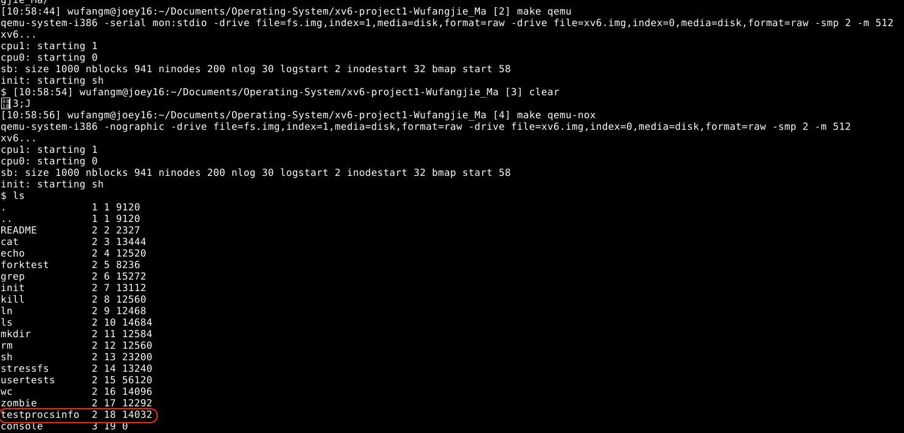
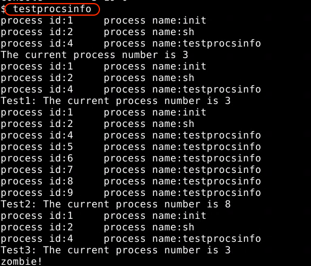
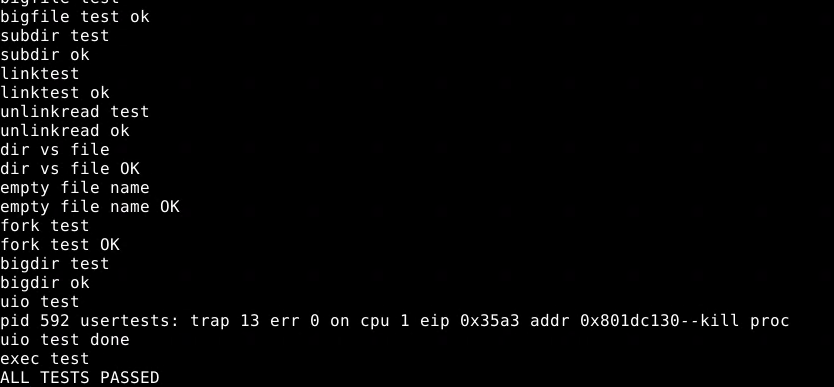

CPSC-8240-Advanced Operating System Assignment
================================================
# Project 1: Add System call--getprocsinfo()


## Here are the code modified in xv6 for Project1

### 1. Create the file of `procinfo.h` and add the struct of procsinfo to `procinfo.h` *(lines between 1-6)*

```c
struct procinfo
{
  int pid;
  char p_name[16];
};
```
### 2. Include `procinfo.h` first and add the function of `getprocsinfo(struct procinfo*) ` to `proc.c`  *(lines between 68-88)*. 
In this function,  I use it to get all the processes that running in the xv6 system by iterating ptable(defined in `proc.c`) and return the number of running processes. Besides of that, I print each process's number and name in the console.


```c
int 
getprocsinfo(struct procinfo* p)
{
	  struct proc *proc;
	  int num_proc =0;
	  //spinlock.c
	  acquire(&ptable.lock);
	  for (proc = ptable.proc; proc < &ptable.proc[NPROC]; proc++)
	  {
	    if(proc->state == RUNNABLE || proc->state ==RUNNING || proc->state == SLEEPING)
	    {
		      p->pid = proc->pid;
		      //string.c
		      safestrcpy(p->p_name, proc->name, sizeof(proc->name));
		      //console.c
		      cprintf("process id:%d \t process name:%s", p->pid, p->p_name);
		      cprintf("\n");
		      num_proc++;
	    }
	  }
	  //spinlock.c
	  release(&ptable.lock);
	  return num_proc;
}  
```
		
**Note that `NRPOC` represents maximum number of processes(defined in the file of `param.h`)  and `acquire()` ,`release()` are the function of adding the mutual exclusive spin lock for keeping process safty. `ptable` is a struct which store all the running processes.**

### 3. Include `procinfo.h` add the function of `sys_getprocsinfo(void)` to `sysproc.c` *(lines between 95-107)*
In `sysproc.c`, I use the function of `sys_gerprocsinfo(void)` to call the low level implemetation (`getprocsinfo(struct procinfo*)` ) mentioned above.
	
```c
int sys_getprocsinfo(void){
	struct procinfo proc_info[NPROC];  
	//argptr implement in the file of syscall.c
	if (argptr(0, (void*)&proc_info, NPROC*sizeof(*proc_info)) <0) {
		cprintf("Error called by the function of argptr(), pointer out of the address space");
		return -1;
	}
	return getprocsinfo(proc_info);
}
```
**Note that `if condition` is to judge whether pointer is out the address space or not.**
	

### 4. Add system call number for the function of sys_getprocsinfo(void) to `sysproc.h`, where the number is 22 *(line 23)*
```c
#define SYS_getprocsinfo 22	
```

### 5. Extern `sysgetprocsinfo(void)` to `syscall.c`*(line 107)* and make the connection between that function and their system call number in the file of `syscall.c`*(line 131)*. (`procinfo.h` should also be included in `syscall.c`)

```c
extern int sys_getprocsinfo(void);
```

```c
[SYS_getprocsinfo] sys_getprocsinfo
```


### 6. Add struct procsinfo and the function of `getprocsinfo(struct procinfo*)` to `def.h`*(line 12 and line 125)*

```c
struct procinfo;
```

```c
int             getprocsinfo(struct procinfo*);
```

### 7. To test our system call, we need to add our struct and function to the file of `user.h` and write a new C file call `getprocsinfotest.c`
- Add our struct procsinfo and funtion to `user.h` *( line 3 and 28)*.

```c
struct procinfo;
```
```c
int getprocsinfo(struct procinfo*);
```

- Add `SYSCALL(getprocsinfo)` to the file of `usys.S`

```c
SYSCALL(getprocsinfo)
```

- In the test file of `procsinfotest.c`,   I firstly  call `geteprocsinfo(procinfo*)` to get the number of currently running process and print their infomation; then the function of`forked()` call the `fork()`function to create 5 child processes and also use `geteprocsinfo(procinfo*)` to get the running process number after create child processes; In the final,  I called `wait()` to wait for child process exit and use `geteprocsinfo(procinfo*)` to print the infomation of the currently running processes. (The result will show in the next section.)

```c
int stdout = 1;

void forked(){
    if(fork()){

    }else{
        sleep(3);
        exit();
    }
}
void testgetprocsinfo(){
    struct procinfo procs_info[NPROC];
    int i;
    int num_procs = 0;
    num_procs = getprocsinfo(procs_info);
    if (num_procs < 0) {
        printf(stdout,"Get process num failed, num_procs < 0");
        exit();
    }else{
        printf(stdout,"The current process number is %d\n", num_procs);
        num_procs = getprocsinfo(procs_info);
        printf(stdout,"Test1: The current process number is %d\n",num_procs);
        for(i = 0; i < 5; i++)
        {
            forked();
        }
        num_procs = getprocsinfo(procs_info);
        printf(stdout, "Test2: The current process number is %d\n", num_procs);
        for(i = 0; i < 3; i++)
        {
            wait();
        }
        num_procs = getprocsinfo(procs_info);
        printf(stdout, "Test3: The current process number is %d\n", num_procs);
        exit();
    }
}
int main(int argc, char *argv[])
{

    testgetprocsinfo();
    exit();
}
```
**Note that: Since the command of `testgetprocsinfo` is too long to be fully displayed on the console, I have change command `testgetprocsinfo` to `testprocsinfo`**


## To run my xv6

### 1. To compile my xv6, you should run the `make` command.

### 2. To run my xv6, you should run the command of `make qemu` or `make qemu-nox`*(hide the qemu console)*. After running my xv6, you can see our test command has added to the system


**Note that: Since the command of `testgetprocsinfo` is too long to be fully displayed on the console, I have change command `testgetprocsinfo` to `testprocsinfo`**


### 3. After execute the `testprocsinfo` command, we can see the result:



### 4. Our system call also have not influenced the usertest:
