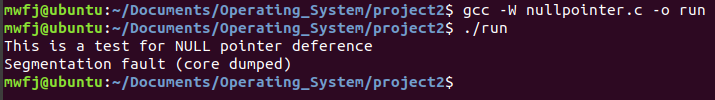
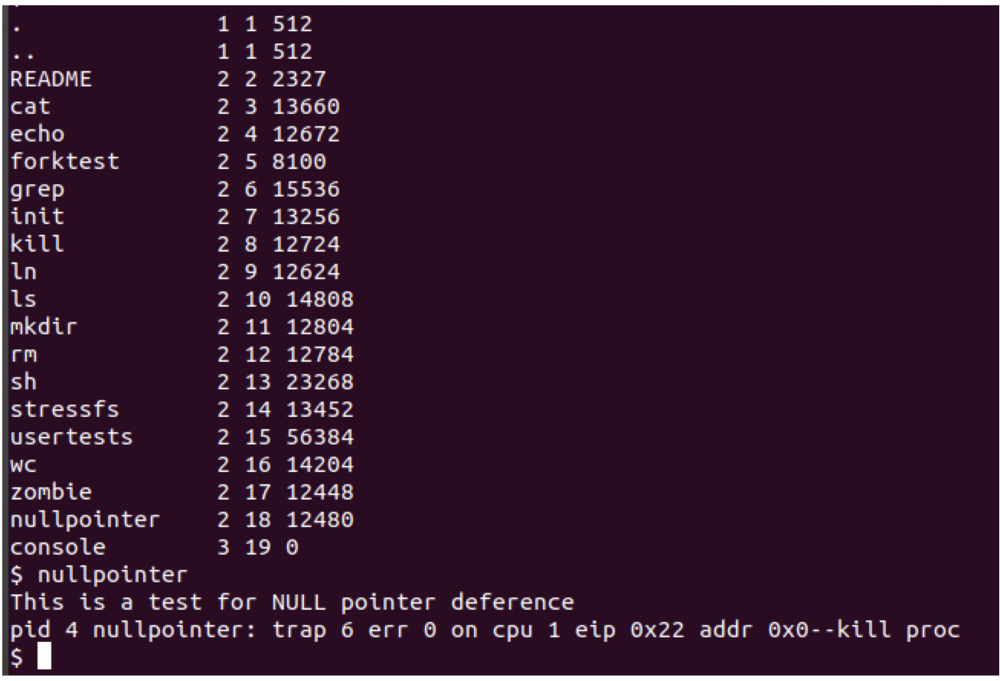
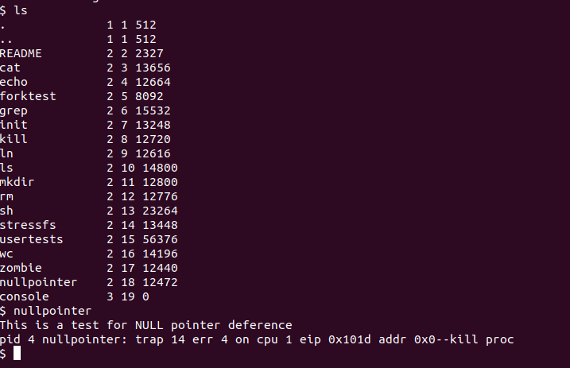
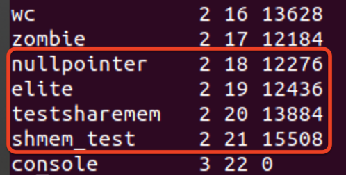
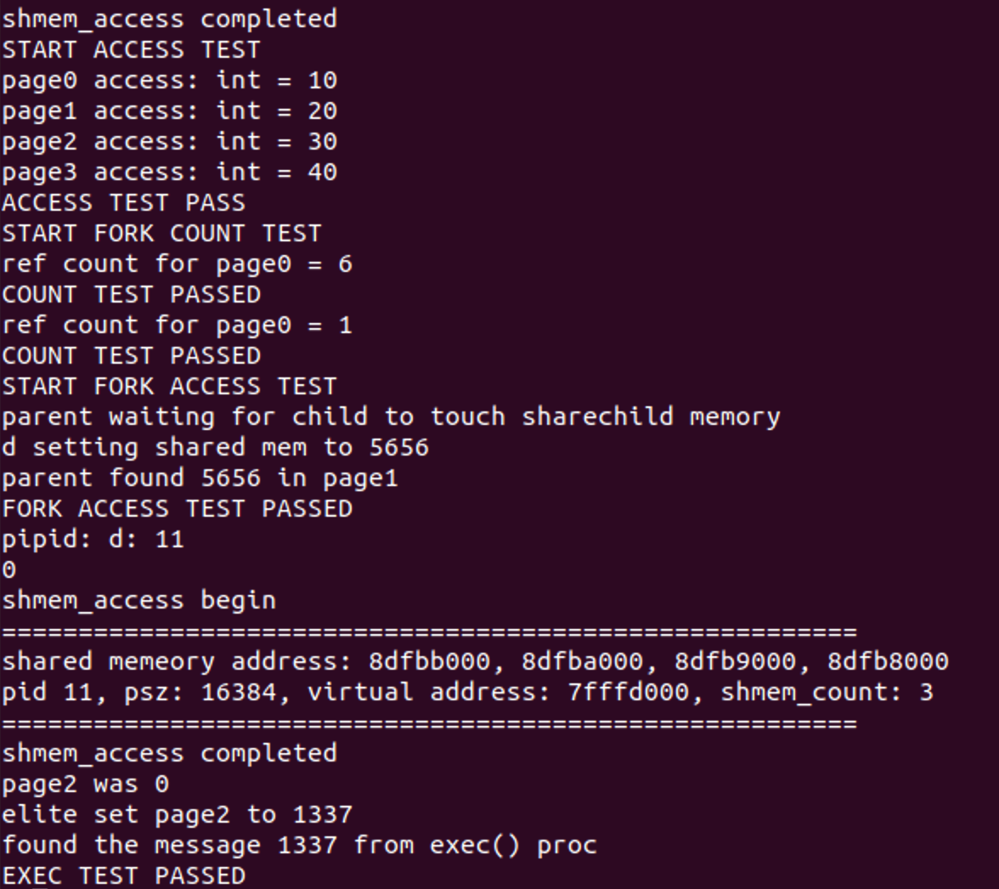

#Project2: Null Pointer and Share Memory


##Part1: Null Poiner Deference
============================================
###In origianl xv6, unlike other Linux, it doesn't have the function for checking Null Pointer Deference
**We can see that linux has the Null Pointer Check:**



**But original xv6 doesn't have:**




###The basic idea is to skip the first page(virual address is zero) and make the xv6 begin to the second page when booting the system.
###The reason is that  original xv6 begin to the first page. When null pointer exist, it will point to the first page---A exist address, which will not trigger the null pointer exception.

**Here is what I changed in xv6 to implecate that function:** 

 1. change `exec.c` line 44 `sz=0` --> `sz=PGSIZE`
2.  add `i==0` in the if condition in the file of `syscall.c` line 69
3.  change `i=0` to `i=PGSIZE` in the function of  `copyuvm()` from the file of `vm.c` line 330
4.  Change Makefile: Change `0` to `0x1000` in the line of 149 and 156
5.  Change p from `0` to `4096` in the function of validatetest(line 1563 in usertests.c) for passing the usertest.

###After I implemented the function above, we can find that system recognize null pointer exception:
 


##Part 2: Shared Pages
============================================
###The purpose in this part is to create a share memory page, where this page can be shared by multi-pages, in order to fulfill the communication between different pages. In share page memory, multiple pages can use this share memory simultaneously. Specfically, the address  shared by multiply pages should be same and the share page memory won't be freed after the user process freed.
###The basic idea is to create three funcitons, one for initialize the share page memory(`void shmem_init(void)`), one for get the address of this share page memore(`void* shmem_access(int page_number)`), and one for count how many pages are using this share page memory right now(`int shmem_count(int page_number)`).

Here is what I changed  in this part:

+ add  `int sm_counts[NSHAREPAGE];` and `void* sm_addr[NSHAREPAGE];` in the beginning of `vm.c`(line 14 and 15) to store the sharememory address and share memory count.
+ add `void* shared_page[NSHAREPAGE];` in the structure of `proc` in the file of `proc.h`(line 52)
+  defined NSHAREPAGE in `param.h` line 14 `#Define NSHAREPAGE      4`
+  define the function of `void shmem_init(void)`(line 415-432 )  and initilize it in `main.c`(line 37)

```c
void shmem_init(void){

  int i;
  for(i = 0; i < NSHAREPAGE; i++)
  {
    //initial sharemem
    sm_counts[i] = 0;
    if ( (sm_addr[i] = kalloc()) == 0 ) {
      panic("shared memory init failed\n");
      return (void)-1;
    }
    memset(sm_addr[i], 0, PGSIZE);
    //V2P change virtual address to physical address
    cprintf("The initial address in SharedPage would be %x\n", V2P(sm_addr[i]));
  }
  cprintf("shmem_init completed\n");
}
```

+  define a function call `int shmem_count(int page_number)` to count how many pages are using the same share memory page right now(line 477-485 in `vm.c`)

```c
// the purpose of this function is to count how many processes are using the same share page.
int shmem_count(int page_number){
  if (page_number < 0 || page_number > NSHAREPAGE) {
    cprintf("illegal page number");
    return -1;
  }
  
  return sm_counts[page_number];
}rn share_memory_count[page_number];
}
```

+ defined a function call `void* shmem_access(int page_number)` to get the address of share page memory(line 434-474 in `vm.c`)

```c
//The purpose of this funciton is to get the start virtual address for each page
void* shmem_access(int page_number){
  // Check whether page number is illegal
  if (page_number < 0 || page_number >= NSHAREPAGE) {
    cprintf("illegal page number\n");
    return (void*)-1;
  }
  cprintf("shmem_access begin\n");
  struct proc *current_proc = myproc();
  //  Check whether the share memory is already allocated for given page number.
  if (current_proc->shared_page[page_number]!=0)
  {
    cprintf("%d page haven't allocate space for share memory\n", page_number);
    return (void *)(current_proc->shared_page[page_number]);
  }
  void* virtual_addr = (void*)( KERNBASE - ( page_number+1 ) * PGSIZE );
  // Check whether virtual address is illegal
  if ( current_proc->sz > V2P(virtual_addr) )
  {
    cprintf("Virtual Address is Illegal\n");
    return (void*) -1;
  }
  
  if ( mappages(current_proc->pgdir, 
      virtual_addr, PGSIZE, 
      V2P(sm_addr[page_number]), 
      PTE_W|PTE_U) < 0 
      )
  {
    panic("mappages is fail in the shmem_access\n");
  }
  
  sm_counts[page_number]++;
  current_proc->shared_page[page_number] = virtual_addr;
  cprintf("========================================================\n");
  cprintf("shared memeory address: %x, %x, %x, %x\n", 
		sm_addr[0], 
		sm_addr[1], 
		sm_addr[2], 
		sm_addr[3]);
  cprintf("pid %d, psz: %d, virtual address: %x, shmem_count: %d \n",
  		current_proc->pid, 
  		current_proc->sz, 
  		(uint) virtual_addr, 
  		sm_counts[page_number]);
  cprintf("========================================================\n");
  cprintf("shmem_access completed\n");
  return virtual_addr;
}
```

+ Modify `exec.c`(line 93-98): Initializa the share page information in the current process

```c
  //Project2 Share Memory Begin:
  // Initialize the shared page information.
  for (int i = 0; i < NSHAREPAGE; i++) {
    curproc->shared_page[i] = 0;
  }
  //Project2 Share Memory End.
```

+ Modify `copyuvm` for increasing the number of share page when calling it in the `fork` function in `proc.c`

```c
  for (int i = 0; i < NSHAREPAGE; i++)
  {
    if (parent->shared_page[i])
    {
      child->shared_page[i] = parent->shared_page[i];
      // Remap from Virtual Address to Physical Address
      if(mappages(d, child->shared_page[i], PGSIZE, V2P(sm_addr[i]), PTE_W|PTE_U) < 0 ){
        goto bad;
      }
      sm_counts[i]++;
    }   
  }
```

+ Modify `freeuvm()` for only deallocate non-shared memory(line 300 in `vm.c`)
+ Modify `wait()` in `proc.c`(line 308-318): when a process destory, minus `shme_count` and clear the share memory space the in the current process.

```c
    int i;
    for(i = 0; i < NSHAREPAGE; i++)
    {
      if (p->shared_page[i])
      {
        p->shared_page[i] = 0;
        sm_counts[i]--;
      }   
    }
```

+ add the function of `int shmem_count(int page_number)` and `void* shmem_access(int page_number)`  to system call (in `sysproc.c`, `defs.h`, `usys.S`,  `syscall.c` and `syscall.h`)
+ add  `int shmem_count(int page_number)` and `void* shmem_access(int page_number)` in `user.h`(line 26 and 27)

##Testing for Part 2

For testing, I have add programs of  `elite.c`, `shmem_test.c` and `testsharemem.c` to test the part 2 and `nullpointer.c` to test part1 in xv6.



For testing part1, run the command `nullpointer`

For testing part 2, run the command `testsharemem` or `shmem_test`. 

Specifically,  I created to child processes and one parent process. Those processes should share the same share page memory address. Also, one of the child will change the value store in share memory. Once it changed, the other process will see the different.


The testing result of part 2:




For the result in the null pointer deference, you can check the part 1 in this README.

