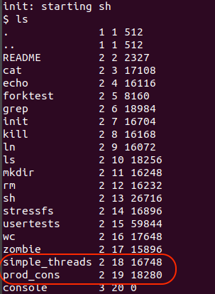
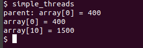
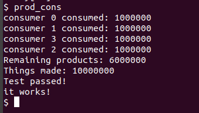
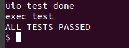

# Project3: xv6 Threads

## Clone and Join
###In this project, I have create two function in proc.c: `clone`(line 557-622) and ` join`(line 624-680), which is used for creating a new kernel thread and waiting  child thread if it is a child of the calling process and add `void* ustack`, `isThread` in `proc.h`. Specifically, `isThread` is used for judging which the current running process is a normal process or a thread, `ustack` is a stack only belongs to thread.
### Moreover, I add `p->isThread = 0` (line 91) in the function of `allocproc`, regarding all process as a normal process when it created.
###Add `np->isThread = 0`(line 216) in` fork()` to mark that the process created by `fork()` is a normal process. Conversely, I add `np->isThread = 1` in `clone()` to mark that the process created by `clone()` is a thread.
####Also, `wait()` should ignore thread, so I add line 302-304(code shown below) and `curproc->isThread` in `wait()`
```c
  if (p->isThread) {
        continue;
	}
```
###For making these function to be sysbem call, I also change the parts below:
+  Add `#define SYS_clone	 22` and `#define	SYS_join 23` in `syscall.h`
+  Add  `sys_clone(void)` and `sys_join(void)` in sysproc.h

```c
int sys_clone(void){

  char* fcn;
  char* stack;
  char* arg;
  if( 
  	argptr(0,&fcn, sizeof(char*)) < 0 
  	|| 
  	argptr(1, &arg,sizeof(char*)) < 0 
  	|| 
  	argptr(2, &stack,sizeof(char*)) < 0
  	 ){
    return -1;
  }
  return clone((void*)fcn,(void*)arg,(void*)stack);
}

int
sys_join(void){
  int pid;
  if (argint(0, &pid)<0) {
    return -1;
  }
  return join(pid);
}
```

+  Add `extern int sys_clone(void); `and  `extern int sys_join(void);` ,  `[SYS_clone]   sys_clone` , `[SYS_join]    sys_join` In `syscall.c`
+  Add function `clone` and `join` in `usys.S`, `defs.h`, `user.h`


## Thread library: `Kthread.h` and `Kthread.c`
###In `Kthread.h` and `Kthread.c`, I have implement five function: 
+ `kthread_t thread_create(void (*start_routine)(void *), void *arg);`
+ `int thread_join(kthread_t k);`
+ `void init_lock(lock_t *lock);`
+ `void lock_acquire(lock_t *lock);`
+ `void lock_release(lock_t *lock);`

### And also add this function of `Makefile` in the part of `ULIB`(line of 146)

## Testing
###For testing, I create two command line `simple_threads` and `prod_cons` in my xv6(testing code given by TA).

###The result shown below:
+ simple_threads:



+ prod_cons



###My xv6 also passed usertests:



