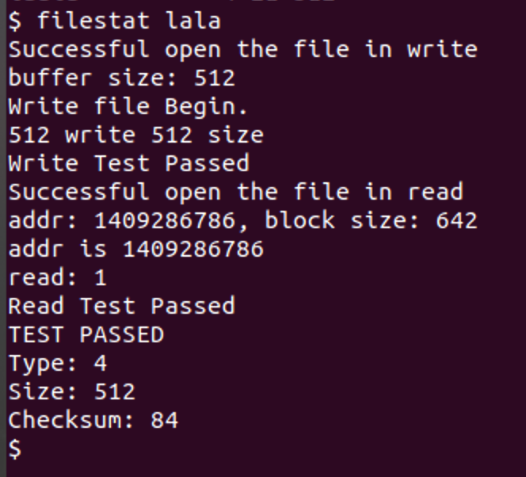
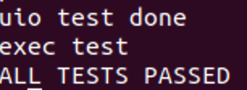

# Project 4: XV6 Scheduler and File Sytsem
<br>
## Part A
### **XV6 Scheduler**

In this part I modified the function of `scheduler` to `priority-based scheduler`<br>
Specifically, I used the new proc structure that TA give us, which add   `uint sched_time;`|  `uint lop_ticks; `|`uint hip_ticks; `|`enum procpri pri;`<br>
**First**, I built a syscall `int setpri(int priority)` to set the priority for each process. The basic idea is check the legality of function parameter, and put that information to the current process.

```c
int setpri(int priority){
  if (priority < 1 || priority > 2)
  {
    cprintf("illegal priority\n");
    return -1;
  }
  struct proc *p = myproc();
  acquire(&ptable.lock);
  p->pri = priority;
  release(&ptable.lock);
  return 1;
}

```

**Second**, I created a syscall `int getpinfo(struct pstat* ps)` to get each process's information:

```c
int getpinfo(struct pstat* ps){
  struct proc* p;
  int count = 0;
  acquire(&ptable.lock);
  for ( p = ptable.proc; p < &ptable.proc[NPROC]; p++)
  {
    if (p->state ==UNUSED)
    {
      ps[count].inuse = 0;
    }else{
      ps[count].inuse = 1;
    }
    ps[count].pid = p->pid;
    ps[count].hticks = p->hip_ticks;
    ps[count].lticks = p->lop_ticks;
    count++;
  }
  release(&ptable.lock);
  return 0;
}
```
**Third**,  I modify the contect of the function of  `scheduler`, where the scheduler now can run with priority.the scheduler should run processes that have the high priority (2). If there are two or more processes that have the same high priority, the scheduler should round-robin between them. A low-priority (level 1) process does NOT run as long as there are high-priority jobs available to run.

```c
void
scheduler(void)
{
  struct proc *p;
  uint tdif;
  struct cpu *c = mycpu();
  c->proc = 0;
  
  for(;;){
    // Enable interrupts on this processor.
    sti();
    // commented out to compile; may be useful to you
    
    acquire(&ptable.lock);
    enum procpri search_pri = LOW_PRI;

    // TODO: Change to priority scheduler starting here
    for (p = ptable.proc; p < &ptable.proc[NPROC]; p++)
    {
      if (p->state != RUNNABLE || p->pri < search_pri)
      {
        continue;
      }
      if (p->pri > search_pri && p->pri == HIGH_PRI)
      {
        search_pri = p->pri;
        break;
      }
    }

    // Loop over process table looking for process to run.
    for(p = ptable.proc; p < &ptable.proc[NPROC]; p++){
      if(p->state != RUNNABLE)
        continue;

      // on return
      // Switch to chosen process.  It is the process's job
      // to release ptable.lock and then reacquire it
      // before jumping back to us.

      if (p->pri == search_pri)
      {
        c->proc = p;
        switchuvm(p);
        p->state = RUNNING;
        p->sched_time = sys_uptime();
        swtch(&(c->scheduler), p->context);
        switchkvm();

        // Process is done running for now.
        // It should have changed its p->state before coming back.        
        tdif = sys_uptime() - p->sched_time;
        switch (p->pri)
        {
            case LOW_PRI:
            {
                p->lop_ticks += tdif;
                break;
            }
            case HIGH_PRI:
            {
                p->hip_ticks += tdif;
                break;
            }
            default:
            {
                panic("priority");
                break;
            }
        }
        if (p->state != ZOMBIE && p->pri > search_pri)
        {
          search_pri = p->pri;
        }
        c->proc = 0;
      }
    }
    // TODO: Changes end here
    // IMPLICIT release(&ptable.lock) here; 
    // ptable WILL be different next iteration
    release(&ptable.lock);
  }
}
```

**Fourth**, add system call for`int getpinfo(struct pstat* ps)`and `int setpri(int priority)` in the file of `defs.h`, `syscall.c`, `syscall.h`, `sysproc.c`, `usys.S` and `user.h` just like what we do in previous project.

### Test:
For testing, I add the program TA give us in my xv6 system called **`testpriority`**. When you enter my xv6, just input testpriority command to test my scheduler. My scheduler has passed the test!

## Part B
### 1) File System Checker

The goal of makeing the File system checker:

+ Each inode is either unallocated or one of the valid types (T_FILE, T_DIR, T_DEV). ERROR: bad inode.

+ For in-use inodes, each address that is used by inode is valid (points to a valid datablock address within the image). Note: must check indirect blocks too, when they are in use. ERROR: bad address in inode. Root directory exists, and it is inode number 1. ERROR MESSAGE: root directory does not exist.

+ Each directory contains . and .. entries. ERROR: directory not properly formatted. Each .. entry in directory refers to the proper parent inode, and parent inode points back to it. ERROR: parent directory mismatch.

+ For in-use inodes, each address in use is also marked in use in the bitmap. ERROR: address used by inode but marked free in bitmap. For blocks marked in-use in bitmap, actually is in-use in an inode or indirect block somewhere. ERROR: bitmap marks block in use but it is not in use.

+ For in-use inodes, any address in use is only used once. ERROR: address used more than once.

+ For inodes marked used in inode table, must be referred to in at least one directory. ERROR: inode marked use but not found in a directory.

+ For inode numbers referred to in a valid directory, actually marked in use in inode table. ERROR: inode referred to in directory but marked free.

+ Reference counts (number of links) for regular files match the number of times file is referred to in directories (i.e., hard links work correctly). ERROR: bad reference count for file.

+ No extra links allowed for directories (each directory only appears in one other directory). ERROR: directory appears more than once in file system.

For making this code, I just follow the thought and writing style in the file of `fs.c`and `mkfs.c`. <br>
In my xv6,  I create a subdirectory call `linux/` to put my `fsChecker.c`, fs.img and xv6.img, where those two img file created by the original xv6 system. In addition, I made a Makefile for make and test fsChecker.c.

### Test
-
For test my fsChecker.c, you should go to `xv6-project4-WufangjieMa/linux` first. Then running `make` command to run complie `fsChecker.c ` and running `make test`  or `./fsChecker.c fs.img` for test my program.<br>
**Note that** The linux folder has already have the linux program call `fsChecker`, if that is unrunnable, run `make clean` first and then complie it again.

### 2) File System Intergrity
In this part, I add protection form data corruption. Specifically,  I add new type of state call `#define T_CHECKED 4` in `stat.h` first. and I added a parameter called `uchar checksum;` in the structure of stat.<br>
Then, I modified the functinon the four function below in `fs.c`: 

+ `static uint bmap(struct inode *ip, uint bn)` (line 400-405)
+  `void stati(struct inode *ip, struct stat *st)` (line 456-476) 
+  ` int readi(struct inode *ip, char *dst, uint off, uint n)`(line 502-552)
+   `int writei(struct inode *ip, char *src, uint off, uint n)`(line 579-622)

Finally, add the `T_Checked` judge code in the function call `sys_open(void)`.

```c
 if(omode & O_CREATE){
    //FileSystem Intergrity
    if (omode & O_CHECKED) {
      ip = create(path, T_CHECKED, 0, 0);
    }else{
      ip = create(path, T_FILE, 0, 0);
    }
    if(ip == 0){
      end_op();
      return -1;
    }
```

### Test
-

I write a file call  `filestat.c` to test the file system intergrity of my xv6. Specifically, running the command call `filestat file name` to test.
My logic is write a file with check type first and then read this file, printing its information.

```c
#define SIZE 512

void readFile(char* name){
    int fd, n=1,i, r;
    char buf[SIZE];
    fd = open(name, O_RDONLY);
    printf(1,"Successful open the file in read\n");
    for(i = 0; i < n; i++)
    {
        r = read(fd, buf, SIZE);
        printf(1,"read: %d\n",r);
    }
    printf(1,"Read Test Passed\n");
    // close(fd);
}

void writeFile(char* name){
    int fd,i,w;
    int n=1;
    char buf[SIZE];
    fd = open(name,O_CREATE|O_CHECKED|O_RDWR);
    printf(1,"Successful open the file in write\n");
    printf(1,"buffer size: %d\n", SIZE);
    memset(buf, 0, SIZE);
    printf(1,"Write file Begin.\n");
    for( i = 0; i < n; i++)
    {
        buf[0] = (char)('T');
        w = write(fd, buf, SIZE);
        printf(1,"%d write %d size\n",w,SIZE);
    }
    printf(1,"Write Test Passed\n");
    w = close(fd);
}
```
**Result:**<br>


**My program also passed all the usertest!!!**<br>



